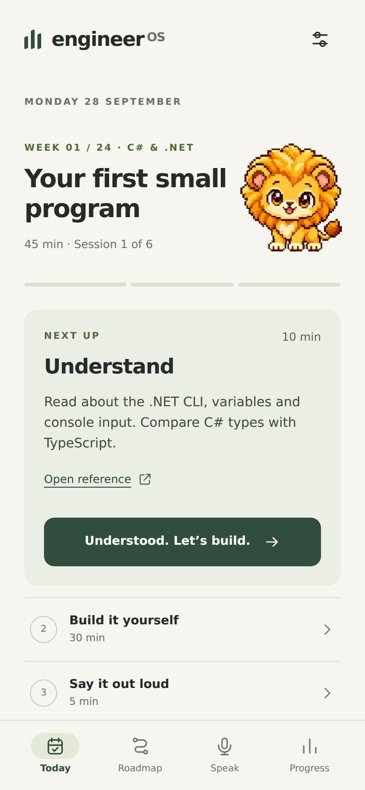
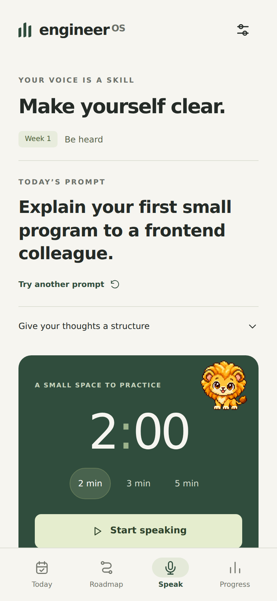

# Engineer OS

An iPhone-first, offline-capable personal learning app for a 24-week software engineering program. Built on the repository’s existing React 19, TypeScript and Vite configuration; the original `/engineer-os/` GitHub Pages base path is preserved.

## Design preview

| Today | Speak |
| --- | --- |
|  |  |

## What you can do

- **Today:** see one active Understand → Build → Speak action. Reopen another step when needed; Leo responds to the current stage.
- **Roadmap:** explore 24 weeks across six collapsible phases, with 144 sessions, weekly deliverables and completion states.
- **Speak:** choose a technical prompt, practice for 2, 3 or 5 minutes, and rate clarity, volume, structure, pace and confidence. The timer uses elapsed wall-clock time, including time spent in another app while the page remains alive. No microphone or recording permission is used.
- **Progress:** see completed sessions, completed weeks, speaking reflections and a daily streak. Assess each skill independently as Seen → Practiced → Can explain → Can build. Completion does not automatically imply mastery.
- **Settings:** change your local start date, export a JSON backup, restore a validated backup, and see Home Screen instructions.

## The program

The default start date is **28 September 2026**. It is stored locally and can be changed at any time without losing completed sessions. Session identifiers remain stable when the schedule shifts.

| Weeks | Focus                                                                  |
| ----- | ---------------------------------------------------------------------- |
| 1–4   | C# / .NET and testing foundations                                      |
| 5–8   | ASP.NET Core, EF Core, PostgreSQL, SQL and Docker                      |
| 9–12  | Software architecture, boundaries and decisions                        |
| 13–16 | Distributed systems, resilience, observability and release engineering |
| 17–20 | System design and design interviews                                    |
| 21–24 | Coding interviews, technical communication, portfolio and applications |

Five 45-minute sessions plus one 150-minute build total **6 hours 15 minutes per week** (150 hours across the program). Each session reserves five minutes for speaking and reflection. Day seven is a rest day. With the default Monday start, the long build is Saturday and rest is Sunday. A different start date shifts that rhythm.

The project evolves from a console job-application tracker into a tested, containerized API. Later exercises use it to explain architectural decisions, failure handling and production trade-offs. System design also includes notification and URL-shortener exercises.

Practice deliberately: attempt without AI, request an explanation only when stuck, implement yourself, invite an AI review afterward, then explain the idea aloud. The app supplies prompts and completion criteria; it does not execute or grade your .NET work. Keep that project in its own repository. You will need a .NET SDK and editor, and later Docker and PostgreSQL, on your development computer.

Sessions follow the calendar rather than automatically rolling every missed task into today. Open any earlier or later session from Roadmap. A changed date never silently completes work. Streaks count consecutive calendar dates on which at least one full session was completed; rest days may end a streak and are still part of the plan.

## Run locally

Use Node.js 24 LTS and npm.

```sh
npm ci
npm run dev
```

Open the URL printed by Vite, including `/engineer-os/`. Hash navigation keeps all four screens compatible with GitHub Pages refreshes.

```sh
npm test
npm run build
npm run preview
```

`npm run build` type-checks, bundles the app and generates a service worker with an exact asset precache. `dist/` is the complete static deployment. No environment variables, server, login, external database or API keys are required. React and React DOM are the only runtime dependencies; system fonts and all app icons are local.

Leo is Samuel's existing custom ChatGPT pet, included as a local transparent WebP sprite atlas with six selected animation rows: idle, wave, jump, waiting, focus and review. Each source cell is 192 × 208 pixels. The app uses CSS `steps()` animations and shows a still frame when reduced motion is enabled. Leo reflects progress and does not score or judge it. The asset is bundled with the app and cached for offline use; the pet service is not called at runtime.

## Deploy to GitHub Pages

1. Merge the implementation branch into `main`.
2. In the repository, open **Settings → Pages → Build and deployment → Source**, and select **GitHub Actions**.
3. Open **Actions → Deploy to GitHub Pages → Run workflow**, select `main`, and run it.
4. After the `deploy` job succeeds, open **https://samuelne-dev.github.io/engineer-os/**. The deployment job also outputs the authoritative URL.

Deployment is deliberately manual: the workflow is prepared but publishing is not triggered by a source push. Run it again after future changes. The separate Verify app workflow runs on pull requests and pushes to `main`.

This repository was private when inspected. GitHub Pages from a private personal repository requires an eligible plan such as GitHub Pro. If Pages is unavailable on your plan, choose whether to upgrade or make the repository public; this implementation does not change repository visibility. A Pages website is generally public even when its source repository is private. Your learning progress is never committed or uploaded by this app.

References: [Vite’s Pages guide](https://vite.dev/guide/static-deploy#github-pages), [GitHub Pages availability](https://docs.github.com/en/pages/getting-started-with-github-pages/what-is-github-pages).

## Add it to your iPhone Home Screen

1. Open the deployed HTTPS URL in **Safari**, and let it load online once.
2. Tap **Share → Add to Home Screen** (you may need to scroll through Share actions).
3. Keep **Open as Web App** enabled if that option is shown, then tap **Add**.
4. Launch **Engineer OS** from its new icon. Settings shows when offline mode is ready.

The app uses standalone display, Apple touch icons, safe-area padding and a bottom navigation bar. An installed app or another browser can have a separate storage context: export your progress before switching and restore it in the new context if needed. External documentation links require internet access.

## Data and offline behavior

- Progress lives under `engineer-os:v1` in localStorage, exclusively on this device/browser. There is no analytics, telemetry or cloud sync.
- Back up through Settings periodically. Clearing website data, uninstall behavior or browser storage eviction can remove local data.
- Restore validates the version, dates, session IDs, skill levels and speaking ratings, then asks before replacing existing progress. Unsupported or malformed data is rejected.
- Storage errors remain visible; the app continues in memory and offers backup export. Corrupt stored data is not silently overwritten.
- After a successful first online load, the app shell, all curriculum data and icons work offline. New releases display an explicit update action, so an active session is not unexpectedly reloaded.
- The speaking timer survives normal tab navigation within the app, but a browser reload or operating-system termination resets an unsaved practice. Saved ratings and session completion persist.

## Verification

```sh
npm test                         # 7 model/curriculum/backup checks
npm run build
npx playwright install --with-deps chromium webkit
npm run test:e2e                  # Chromium mobile + WebKit iPhone emulation
```

Browser tests cover completion and persistence, speaking ratings and history, skill changes, all 24 weeks, rest days, start-date changes, offline reload, backup restoration/export, 320px layouts, timer elapsed time, storage failure, Leo’s state changes and reduced motion. CI installs both browser engines. `CHROMIUM_EXECUTABLE_PATH` optionally selects an existing Chromium binary in constrained environments.

Implementation-session verification: production build, all seven model checks and eight Chromium mobile browser checks passed. CI runs Chromium and WebKit. Mobile screenshots were reviewed at 320px and 390px. A physical iPhone Home Screen check remains recommended, particularly for Safari storage and installation behavior.

## Project map

- `src/curriculum.ts`: 24-week plan, session generation, speaking focuses and official reference links.
- `src/model.ts`: typed progress, validation, local calendar arithmetic and completion logic.
- `src/App.tsx`: the four screens and Settings.
- `src/styles.css`: responsive visual system, touch targets and reduced-motion support.
- `src/Leo.tsx` and `public/leo-atlas.webp`: Leo's animated states from the existing custom pet sheet.
- `src/main.tsx`: React entry and service-worker update handling.
- `scripts/build-sw.mjs`: content-versioned offline precache generation.
- `public/`: manifest and install icons.
- `.github/workflows/`: verification and manual Pages deployment.

The design uses a quiet green accent, warm neutral surfaces, clear rows, one active task and restrained motion. Leo gives a visual cue for the next practice step. Full briefs and other weeks remain available on demand.
